## 新建文件夹

为了方便电脑环境的管理，请不要跳过这一步。

我们在一个好找的地方新建一个**PATH**文件夹，在PATH文件夹下新建一个**Python**文件夹，再在Python文件夹下新建一个**python-3.8.8**
文件夹。

说明一下
PATH文件夹用来管理电脑的各种拓展环境。
PATH>Python文件夹用来管理Python环境。
PATH>Python>python-3.8.8文件夹用来管理3.8.8版本的python。

## 安装python

python的home已经准备好了,现在来安装她。

推荐使用 exe 安装文件来安装 python，而不是直接解压环境压缩包使用。
因为直接解压的环境中是没有 pip 工具的，并且安装 pip 时也会遇到很多麻烦。

你可以从下面的链接中下载到python-3.8.8在Windows64位环境下的exe安装包。
[https://wwe.lanzous.com/iPRT5okcsfe](https://wwe.lanzous.com/iPRT5okcsfe)

下载完成后打开，会看到如下界面。

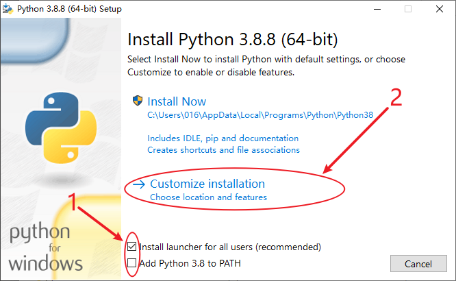

说明：
**1**处的多选项我们使用默认勾选，不要勾选第二项，第二项后续我们手动完成。
并且我们点击**2**处的自定义安装来自己决定怎么安装python。

下面这个界面直接**Next**。

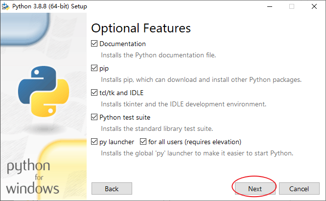

然后会看到如下界面，我们在这选择python的安装位置。
点击**Browse**，选择我们之前新建的文件夹，选择好之后点击**Install**进行安装。如下图所示。

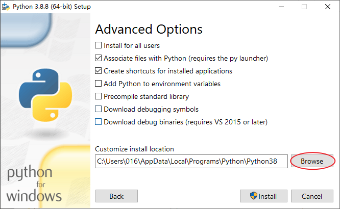
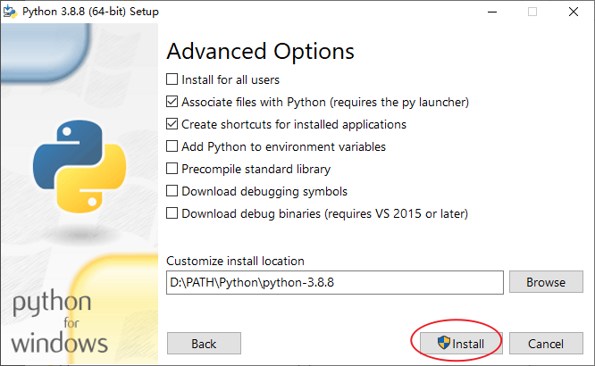

看到如下界面即说明已经安装完成，点击**Close**退出。

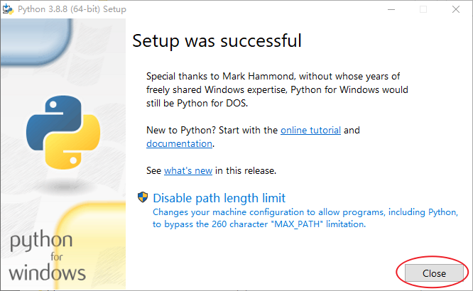

## 本地环境配置

python已经安装到了本地，但是如果想要调用python，我们还需要将python的路径添加到本地环境中。

找到**我的电脑**，鼠标右键点击，点击**属性**，会看到如下界面。点击**高级环境设置**，然后在接下来的界面中点击**环境变量**。如下图所示。
（注意：应该是**我的电脑**，而不是**我的电脑**的快捷方式）


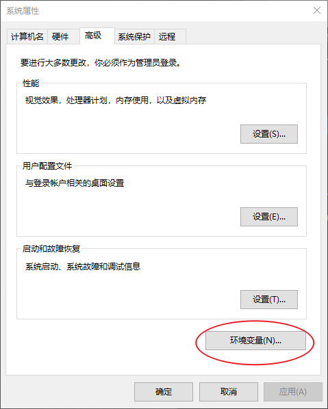

之后会看到如下界面。我们找到其中的**Path**这一行并双击。这一行是本地环境变量的配置，只有添加到其中的内容才可以被本地直接调用。

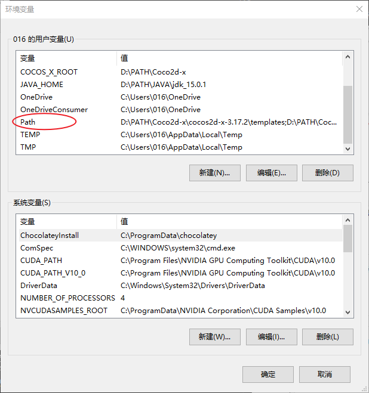

如果你当前的系统已经拥有多个环境变量，那么会弹出如下界面。我们依次点击**新建** > **浏览**，然后选择我们安装python的路径。

这时候把python安装到自定义文件夹的方便就体现出来了。

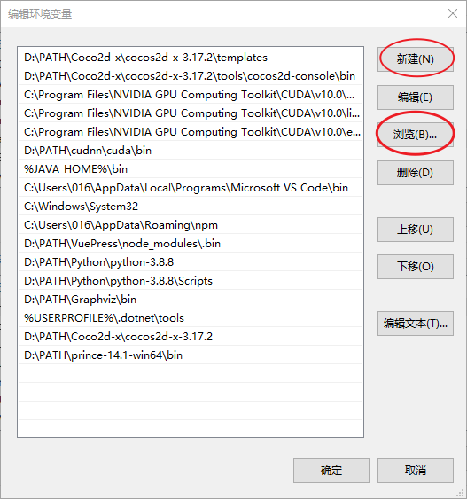

为了能够正常使用python的pip包管理工具，我们还需要将python安装文件夹下的**Scripts**文件夹添加到路径。重复**新建** > **浏览**操作即可。

最后左边一栏应该出现类似下图这样的两行路径，之后依次确定退出即可。

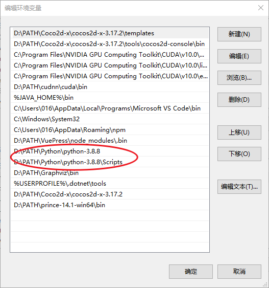

这里有一个需要注意的地方，如果你的电脑之前没有超过一个的环境变量，那你双击**Path**之后弹出来会是像下面这样的一个界面。

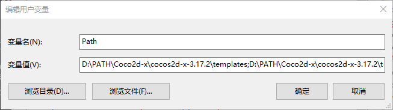

莫慌，只要我们向里面添加一条环境变量之后，再次双击时是会弹出如上演示时的界面的。

添加方法：在那唯一的环境变量末尾添加一个**英文**分号，然后**随意**拷贝一个文件夹的路径粘贴在后面，确认后退出，再次双击**Path**打开时的界面就会发生改变了。

什么？！你说怎么添加英文分号？！怎么拷贝一个文件夹的路径？！好吧 ~ 看下图。

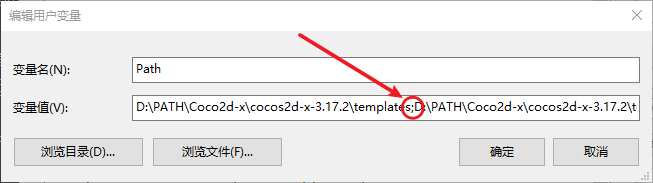
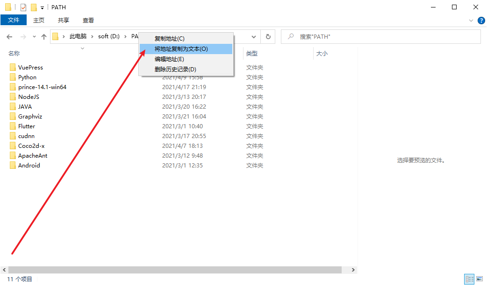

**环境配置结束，让我们检查一下是否配置成功。顺便安装一下 pygame ~**

## 本地环境检查

键盘按下 **Win + R** 键，电脑左下角会弹出如下界面，我们在输入框内输入 **cmd** 后确定。

你说你不知道哪个键是 **Win** 键？！好吧好吧 ~ 先看下图。

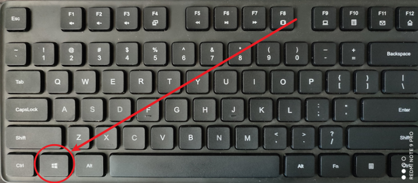

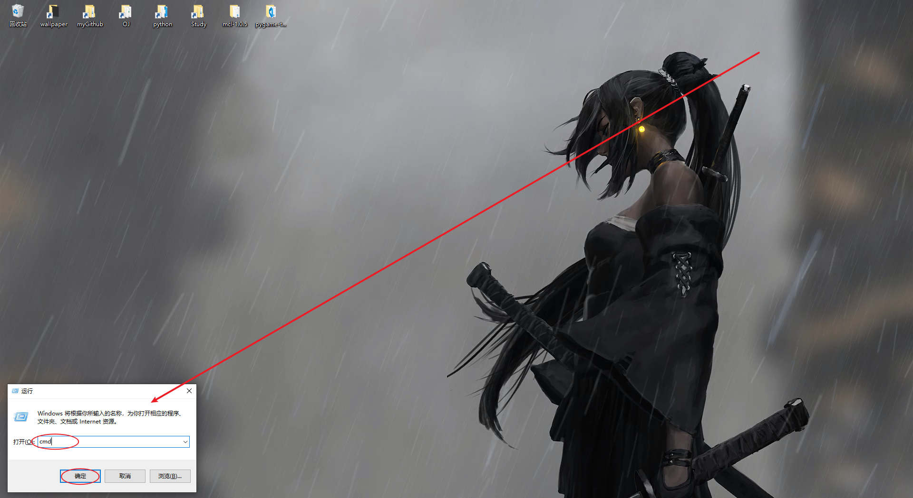

确定之后会弹出一个cmd控制台窗口，如下图。

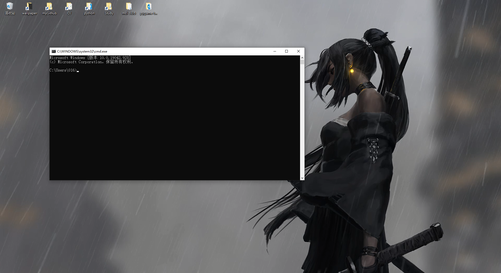

输入 **python** 后回车，若出现以下界面，表示python环境配置无误。

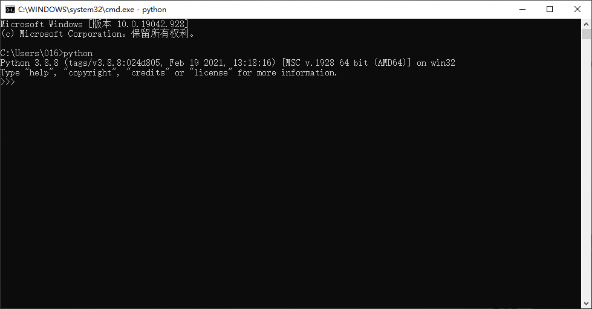

输入 **Ctrl + Z** 后回车，退出python解释器。

再输入 **pip -V** 后回车，若出现以下界面，表示python的pip包管理工具配置无误。


若一下两个环境皆配置无误，我们可以输入下面这条命令并回车：
```bash
pip install pygame
```
说明：
表示使用pip为python下载并安装第三方库pygame。

若出现如下界面，表示pygame安装完成。

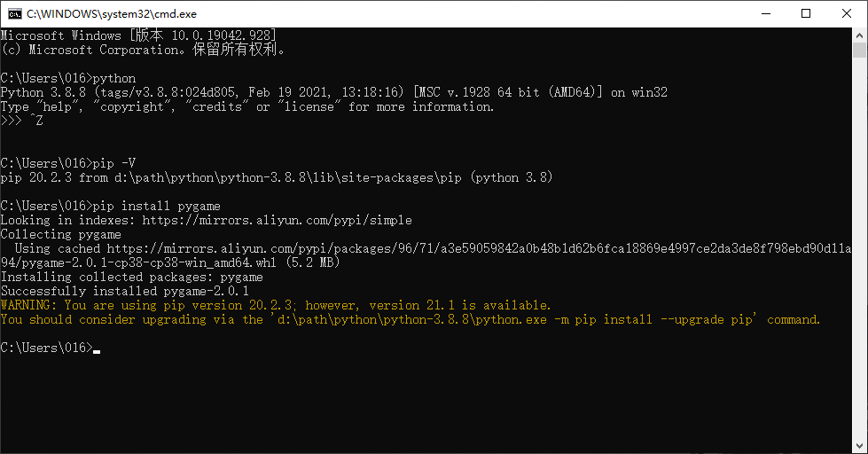

最后的两行黄色警告字体不必关心，那是在提醒你pip出新版本了，请更新pip。

不更新的话pip也能正常使用，所以如果不是不更新不行的话，就不要更新，免得因为更新pip造成更多的问题。
比如：更新后导致pip无法使用。

**环境安装好了，但是python自带的IDLE用起来并不好用，我们需要选择额外的文本编辑器。**
**我们选择Visual Studio Code，轻量，美观，可扩展性高。**

## 安装Visual Studio Code

你可以从下面的链接中下载到VSCOde在Windows64位环境下的exe安装包。
[https://wwe.lanzous.com/irVuKokd3kf](https://wwe.lanzous.com/irVuKokd3kf)

和普通软件的安装相同，如果你想要方便管理的话，也可以把VSCode安装到自定义的位置。

Visual Studio Code安装完成后，是没有安装任何插件的，如果想要使用VSCode开发python程序，需要安装python对应插件。

## 配置Visual Studio Code

首先可以把界面语言设置为中文。如果更喜欢英文的话就看可以不用改了。

找到VScode左侧如下图的扩展按钮并点击。

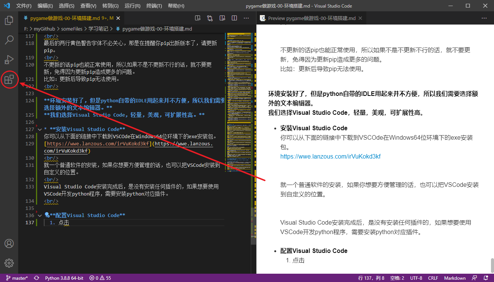

边写文章边截图XD。另外我的VSCode已经配置成中文了。

出现如下界面后，我们在顶部的搜索框内搜索**Chinese**，然后选择第一个，在右侧点击安装。安装完成后右下角会弹出一个窗口提醒重启VSCode，重启后中文语言便会设置成功。

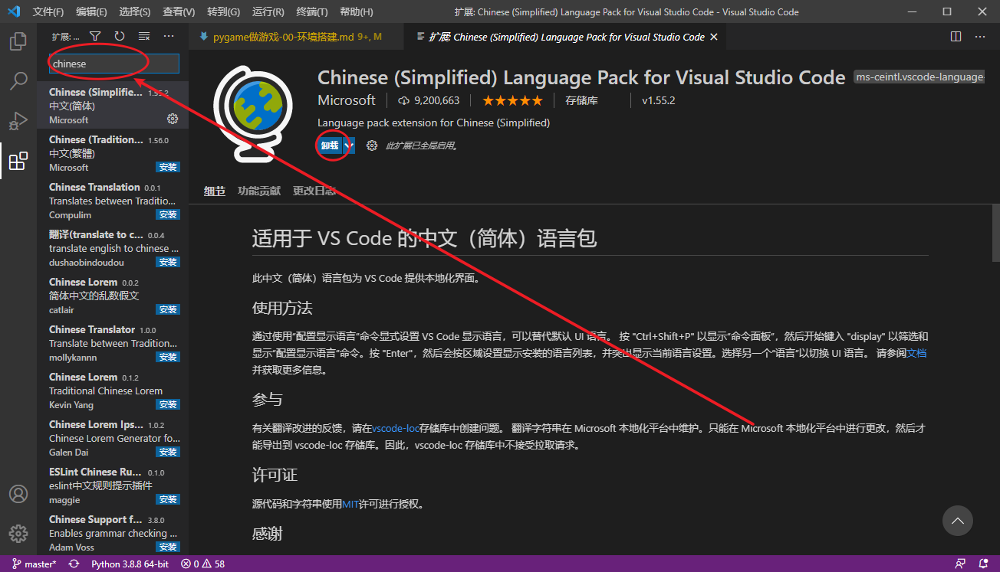

接下来搜索**python**，同样的操作给VSCode安装上python支持插件。

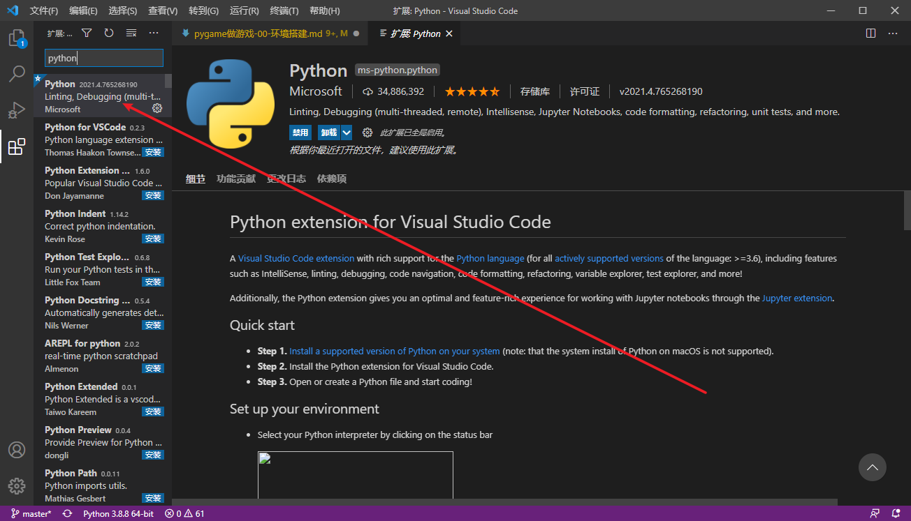

## 开始编写python

新建一个**py**结尾的python文件，将其拖动至VSCode界面中，即可对其进行编辑。

或者通过在VSCode内按下 **Ctrl + N** 来新建一个文件之后，再按下 **Ctrl + S** 来保存文件。文件的后缀名应为**py**。

编辑界面如下图。第一次运行python程序，需要选择使用的解释器，点击VSCode左下角如图所示标志选择即可。也可以先不选择，因为第一次运行时VSCode也会让你选择的。

运行按钮在如下图右上角。

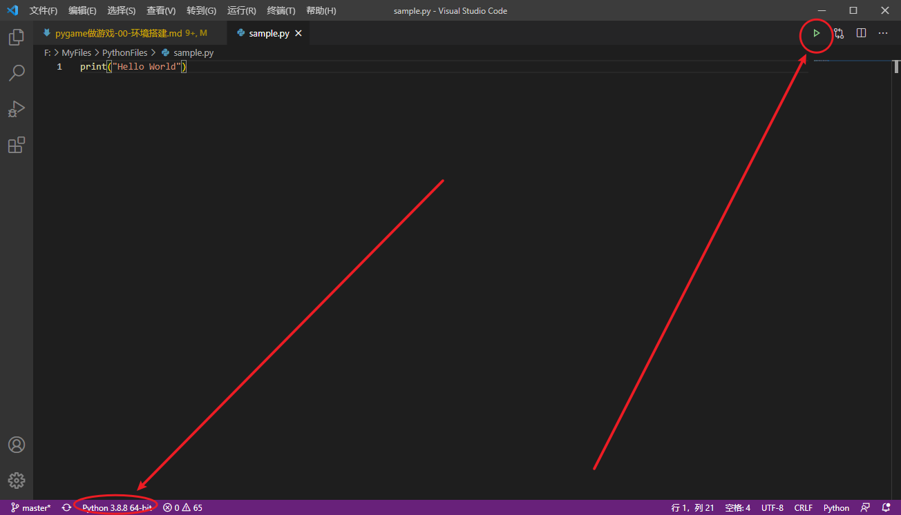

上图写了python的第一个程序，点击运行后，如果如下图在VSCode终端输出了"Hello World"，即表示已经可以开始使用VSCode编写python程序了。

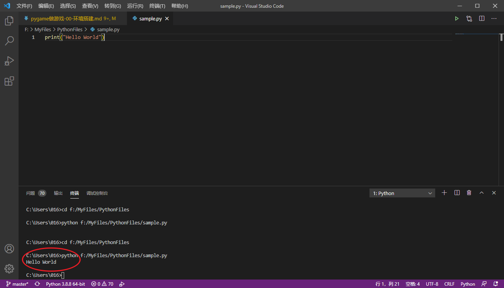

注意：
VSCode的终端是内置的，不会有弹出窗口。
